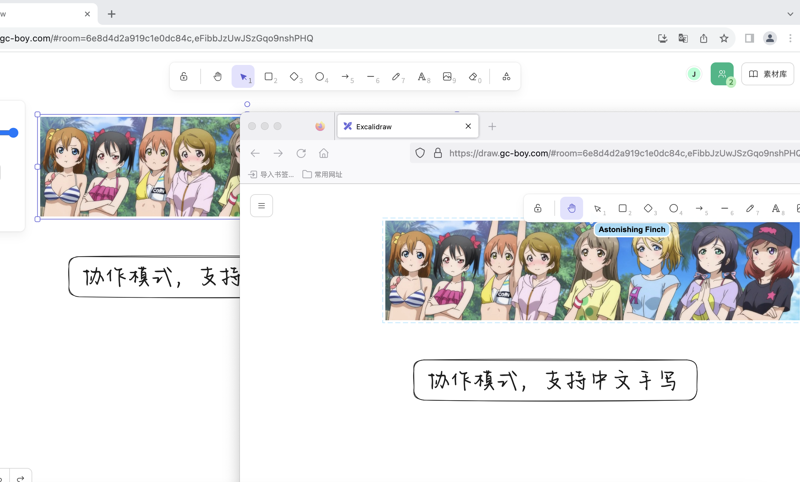

# 基于Excalidraw官方版本16.1，支持中文手写，支持实时协作

截图:



演示网站:

[Live Demo](https://draw.gc-boy.com/)
A live room sample here: [live room](https://draw.gc-boy.com/#room=6e8d4d2a919c1e0dc84c,eFibbJzUwJSzGqo9nshPHQ)

特别感谢[@alswl](https://github.com/alswl)

协作功能需要配合excalidraw-room和excalidraw-storage-backend使用

参考alswl大佬的项目[excalidraw-collaboration](https://github.com/alswl/excalidraw-collaboration)

## Docker构建
1.修改.env.production
  ```
  VITE_APP_HTTP_STORAGE_BACKEND_URL=https://yourdomain/api/v2
  VITE_APP_WS_SERVER_URL=https://yourdomain
  ```
  把yourdomain改成你的域名
2.构建镜像

## 注意事项
1.实时协作需要加密，需要https协议，可以用Nginx反向代理

2.协作空间需要保存数据到后端数据库，excalidraw-storage-backend配合redis实现
